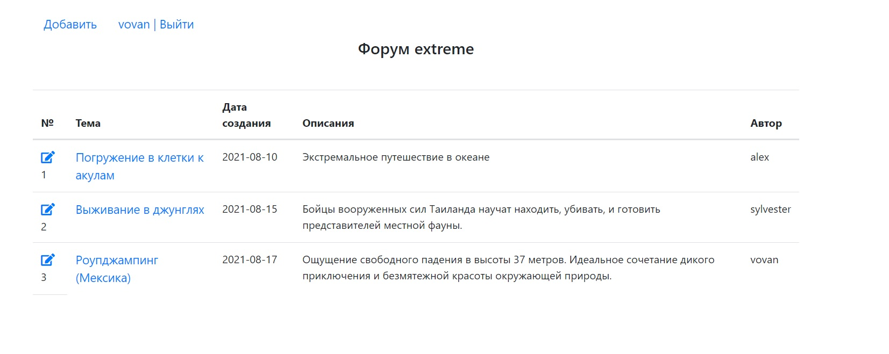

# job4j_forum
Доступ к проекту: https://nameless-garden-55927.herokuapp.com/

Веб - приложение для общения между пользователями, путём размещения сообщений и комментарий
на тему экстрим.

#### Tехнологии:
<ol>
<li> Spring Boot 2 </li>
<li> Spring Security, MVC, Data. </li>
<li> Hibernate </li>
<li> PostgreSQL 9.5 </li>
<li> JSTL/JSP </li>
<li> Java 11 </li>
<li> CSS, Bootstrap </li>
<li> Junit Tests</li>
</ol>

При загрузке URL сайта, появляется следующие:

 Красное предупреждение появляется при неправильном вводе данных.

* Если пользователь не был зарегистрирован необходимо перейти по
верхней ссылки.
  
* Далее главная страница, где пользователь может оставить, изменить пост, 
 или оставить комментарии к посту.
  

* Добавить пост
  
* Редактировать
  
* Добавить комментарии
  